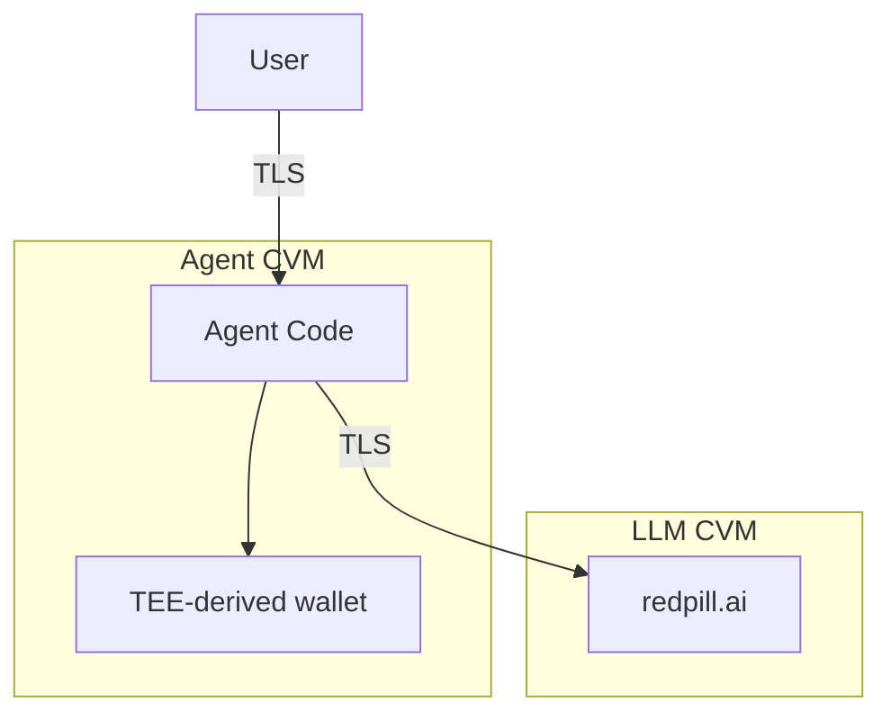

# Secure AI Agent

Run AI agents with TEE-derived wallet keys. The agent calls a confidential LLM (redpill.ai), so prompts never leave encrypted memory.

## Quick Start

```bash
phala auth login
phala deploy -n my-agent -c docker-compose.yaml \
  -e LLM_API_KEY=your-redpill-key
```

Your API key is encrypted client-side and only decrypted inside the TEE.

Test it:

```bash
# Get agent info and wallet address
curl https://<endpoint>/

# Chat with the agent
curl -X POST https://<endpoint>/chat \
  -H "Content-Type: application/json" \
  -d '{"message": "What is your wallet address?"}'

# Sign a message
curl -X POST https://<endpoint>/sign \
  -H "Content-Type: application/json" \
  -d '{"message": "Hello from TEE"}'
```

## How It Works



The agent derives an Ethereum wallet from TEE keys:

```python
from dstack_sdk import DstackClient
from dstack_sdk.ethereum import to_account

client = DstackClient()
eth_key = client.get_key("agent/wallet", "mainnet")
account = to_account(eth_key)
# Same path = same key, even across restarts
```

Both the agent and the LLM run in separate TEEs. User queries stay encrypted from browser to agent to LLM and back.

## API

| Endpoint | Method | Description |
|----------|--------|-------------|
| `/` | GET | Agent info, wallet address, TCB info |
| `/attestation` | GET | TEE attestation quote |
| `/chat` | POST | Chat with the agent |
| `/sign` | POST | Sign a message with agent's wallet |

## Using a Different LLM

The agent uses redpill.ai by default for end-to-end confidentiality. To use a different OpenAI-compatible endpoint:

```bash
phala deploy -n my-agent -c docker-compose.yaml \
  -e LLM_BASE_URL=https://api.openai.com/v1 \
  -e LLM_API_KEY=sk-xxxxx
```

Note: Using a non-confidential LLM means prompts leave the encrypted environment.

## Cleanup

```bash
phala cvms delete my-agent --force
```

## Further Reading

- [Confidential AI Guide](https://github.com/Dstack-TEE/dstack/blob/master/docs/confidential-ai.md)
- [dstack Python SDK](https://github.com/Dstack-TEE/dstack/tree/master/sdk/python)
