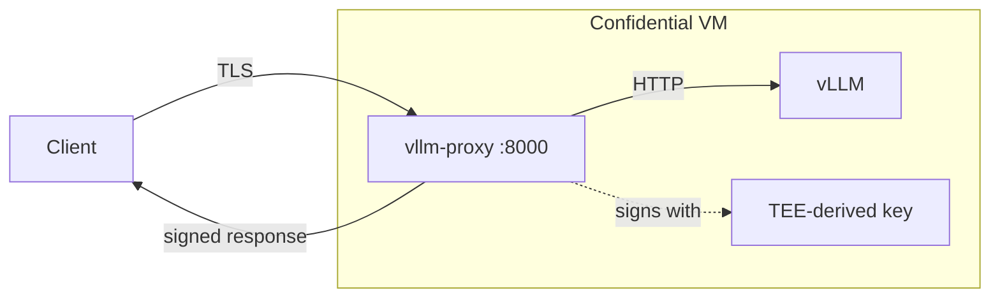

# Private LLM Inference

Deploy an OpenAI-compatible LLM endpoint where responses are signed by TEE-derived keys. Clients can verify responses came from genuine confidential hardware.

## Quick Start

```bash
phala auth login
phala deploy -n my-inference -c docker-compose.yaml \
  --instance-type h200.small \
  -e TOKEN=your-secret-token
```

The `-e` flag encrypts your token client-side—it only gets decrypted inside the TEE.

First deployment takes 10-15 minutes (5GB+ image, model loading). Watch progress:

```bash
phala cvms serial-logs <app_id> --tail 100
```

Test it:

```bash
curl -X POST https://<endpoint>/v1/chat/completions \
  -H "Content-Type: application/json" \
  -H "Authorization: Bearer your-secret-token" \
  -d '{"model": "Qwen/Qwen2.5-1.5B-Instruct", "messages": [{"role": "user", "content": "Hello!"}]}'
```

## How It Works



The proxy authenticates requests, forwards to vLLM, and signs responses with a key derived from the TEE's identity. That signature proves the response came from this specific confidential environment.

## API

OpenAI-compatible. The standard client works directly:

```python
from openai import OpenAI

client = OpenAI(
    base_url="https://<endpoint>/v1",
    api_key="your-secret-token"
)

response = client.chat.completions.create(
    model="Qwen/Qwen2.5-1.5B-Instruct",
    messages=[{"role": "user", "content": "Hello!"}]
)
```

Additional endpoints:

```bash
# Get signature for a response (use chat_id from response)
curl https://<endpoint>/v1/signature/<chat_id> -H "Authorization: Bearer $TOKEN"

# Get attestation report
curl https://<endpoint>/v1/attestation/report -H "Authorization: Bearer $TOKEN"
```

## Using Different Models

Update both the vLLM command and proxy config in docker-compose.yaml:

```yaml
# vLLM service
command: --model meta-llama/Llama-3.2-3B-Instruct ...

# Proxy service
environment:
  - MODEL_NAME=meta-llama/Llama-3.2-3B-Instruct
```

For gated models, add your Hugging Face token:

```bash
phala deploy -n my-inference -c docker-compose.yaml \
  --instance-type h200.small \
  -e TOKEN=your-secret-token \
  -e HF_TOKEN=hf_xxxxx
```

## Updating Secrets

Change tokens without full redeployment:

```bash
phala deploy --cvm-id my-inference -c docker-compose.yaml \
  -e TOKEN=new-secret-token
```

Old tokens stop working immediately.

## Cleanup

```bash
phala cvms delete my-inference --force
```
