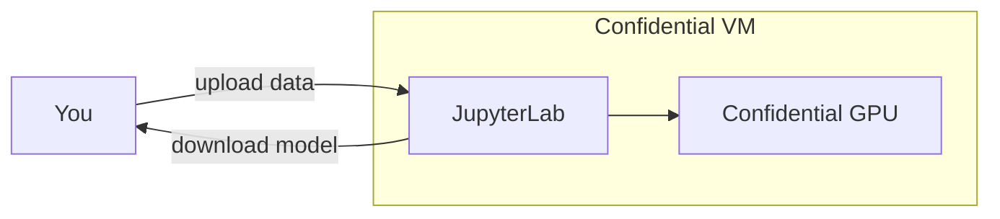

# Confidential Training

Fine-tune LLMs on sensitive data using JupyterLab inside a TEE. Upload your dataset through the browser, run training cells, download your model.

## Quick Start

```bash
phala auth login
phala deploy -n my-training -c docker-compose.yaml \
  --instance-type h200.small \
  -e HF_TOKEN=hf_xxxxx \
  -e JUPYTER_PASSWORD=your-secret
```

Open `https://<endpoint>:8888` and log in with your password.

## Workflow



1. Use the pre-installed notebooks in `/workspace/unsloth-notebooks/` or upload `finetune.ipynb` from this repo
2. Upload your training data (JSONL with `instruction` and `response` fields)
3. Run the cells to train
4. Download the output folder with your fine-tuned weights

Your data and model weights stay encrypted in GPU memory throughout training.

## Cleanup

```bash
phala cvms delete my-training --force
```

## Further Reading

- [Confidential AI Guide](https://github.com/Dstack-TEE/dstack/blob/master/docs/confidential-ai.md)
- [Unsloth](https://github.com/unslothai/unsloth) for the training library
