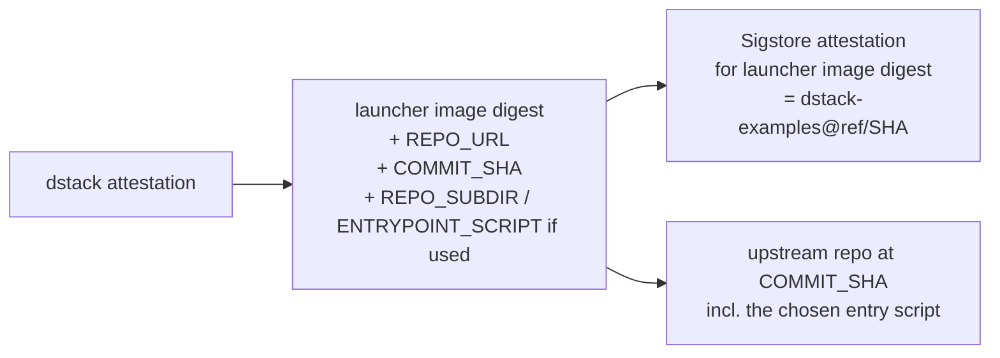
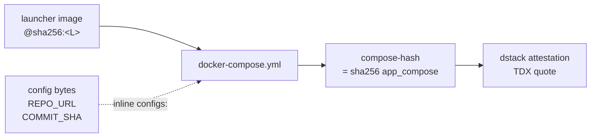
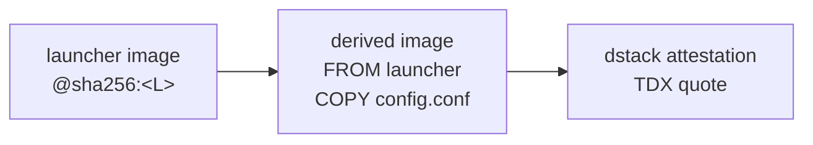

# Verifying a git-launcher deployment

How a relying party verifies that a dstack CVM is running
`git-launcher` and that the workload commit executed inside the
TEE is the one they audited.

## Quick path (default mode, 4 steps)

In default mode the workload repo provides its own `entrypoint.sh` at the
pinned commit, so the trust-bearing config is `REPO_URL + COMMIT_SHA`
(plus `REPO_SUBDIR` and `ENTRYPOINT_SCRIPT` when used, since each selects
which script in the pinned repo gets run) and the install/run command
chain disappears from the verifier's checklist. `WORK_DIR` is local
plumbing and is not trust-bearing.
The whole chain is:



1. **Verify the dstack attestation, and compare reference values.**
   `phala cvms attestation --cvm-id <id> --json` and feed the TDX quote
   into the dstack verifier (or trust the Phala Cloud verifier as a lite
   path). Then compare the attestation's measurements against
   pre-published reference values: `mrtd` and `rtmr0`–`rtmr2` against the
   dstack OS image you expect, the `compose-hash` event against
   `sha256(tcb_info.app_compose)`, the launcher image digest inside the
   attested compose against your audited release digest, and the
   attested `REPO_URL` + `COMMIT_SHA` (and `REPO_SUBDIR` /
   `ENTRYPOINT_SCRIPT` if present) against the workload pin you intended
   to deploy. The deep-path checklist below has the exact extraction
   commands.
2. **Verify launcher image provenance via Sigstore.** Confirm the image
   digest from step 1 carries a build-provenance attestation signed by
   the expected `Dstack-TEE/dstack-examples` GitHub Actions workflow at
   the ref / commit you audited.
3. **Audit the upstream commit.** Check out the workload repo at
   `COMMIT_SHA` and review it. In default mode this single review covers
   the workload code *and* its entry point `entrypoint.sh`; no separate
   install/run command audit is needed.
4. **Spot-check runtime logs.** `phala logs --cvm-id <id>` should show
   `HEAD verified: <COMMIT_SHA>` and `exec in <dir>: bash entrypoint.sh`.
   Logs are corroborating only; the trust root is steps 1–3.

If all four line up, the bytes executing in the TEE are exactly the
upstream commit you audited, produced by an audited launcher.

> **Advanced mode adds one step.** If the launcher config sets `RUN_CMD`
> (and optionally `INSTALL_CMD`) instead of relying on `entrypoint.sh`,
> those strings are trust-bearing deployment config: read them from the
> attested compose in step 1 and audit them like any other deployment
> code — they are not part of the upstream repo at `COMMIT_SHA` and so
> are not covered by its source provenance. The simplification of the
> default mode is exactly that this extra step does not exist.

The rest of this document explains how the chain works and what to do at
each step.

## How the chain works

Two configuration approaches are supported. The recommended one for
production is **compose-mounted config**: the workload pin lives inline in
the compose file, dstack measures the compose into the attested
`compose-hash`, and the same compose can be governed by dstack's KMS
policy. The other approach, **derived image**, bakes the config into a
downstream image; the image digest then covers both launcher and pin.

### Recommended: compose-mounted config



The compose YAML references the generic launcher image by digest and
provides the launcher's config via a compose `configs:` block (with
`content:` inline). In default mode the config is just `REPO_URL` +
`COMMIT_SHA` + `WORK_DIR`; in advanced mode it also carries `RUN_CMD`
(and optionally `INSTALL_CMD`). Either way dstack measures the resulting
`app_compose` JSON into the quote as the `compose-hash` event, so changing
either the image reference or the config bytes changes the attestation.

This is also the surface that dstack KMS policy governs: a CVM can only
unwrap KMS-protected secrets while running a compose whose hash matches
what the policy allows.

### Alternative: derived image



A small downstream image is built `FROM` the launcher image and `COPY`s
the config in. Its single digest binds both launcher and pin. The
attested compose carries just the derived image reference. This avoids
inline `configs:` but means the pin is no longer governed by compose-level
KMS policy — change the pin, rebuild the image, get a new digest.

Use this path if you need a single digest to fully describe the workload,
or if downstream tooling cannot author compose `configs:` blocks.

## Step-by-step verifier checklist

The CLI calls below assume a Phala CLI authenticated against the workspace
that owns the CVM. The CVM identifier can be UUID, `app_id`, instance ID,
or name.

### 1. Fetch and verify the dstack attestation

```sh
phala cvms attestation --cvm-id <id> --json > attestation.json
```

The JSON contains the TDX quote, `tcb_info` (with `mrtd`, `rtmr0`–`rtmr3`,
`event_log`, `app_compose`), and the certificate chain. Feed it into the
dstack verifier (or trust the Phala Cloud verifier as the lite path) to
confirm:

* The quote signs over dstack's measurements with a valid Intel TDX
  signing chain.
* The measurements are consistent with the running platform identity.

### 2. Read image digest and compose hash from the attestation

The attested compose lives at `tcb_info.app_compose` (a JSON string). Its
SHA-256 is the `compose-hash` event in `tcb_info.event_log` (`imr: 3`,
`event: "compose-hash"`), and is what the TDX quote attests.

```sh
jq -r '.tcb_info.app_compose' attestation.json | sha256sum
jq -r '.tcb_info.event_log[] | select(.event=="compose-hash") | .event_payload' attestation.json
```

The two hex strings must match. Then parse the compose and pull the
launcher image reference plus the inline `configs:` block:

```sh
jq -r '.tcb_info.app_compose' attestation.json \
  | jq -r '.docker_compose_file'
```

The image reference is what you compare to your published launcher image
in step 3; the `configs:` block is what you parse in step 5.

#### Reference values to compare

This step is where reference-value checking actually happens — the
attestation is only useful insofar as you compare its measurements to a
known-expected set. Concretely, before signing off on a deployment, decide
the expected value for each row below, then run the JSON-extraction
command and assert equality:

| Reference value | Source of truth | Where in `attestation.json` |
| --- | --- | --- |
| Launcher image digest | The published image digest at the launcher release you audited (and that step 3 verifies via Sigstore). | The `image:` reference inside `tcb_info.app_compose.docker_compose_file`. |
| Compose hash | `sha256` of the JSON-encoded `tcb_info.app_compose` you audited locally. | `tcb_info.event_log[] \| select(.event=="compose-hash") \| .event_payload`. |
| `mrtd` | The TDX measurement of the dstack OS image you expect (published with each dstack OS release). | `tcb_info.mrtd`. |
| `rtmr0` / `rtmr1` / `rtmr2` | Boot-time measurements of the same dstack OS image. Published with the dstack release alongside `mrtd`. | `tcb_info.rtmr0` / `rtmr1` / `rtmr2`. |
| `os-image-hash` event | The dstack OS image hash you expect (matches the `mrtd` / `rtmr0..2` set above). | `tcb_info.event_log[] \| select(.event=="os-image-hash") \| .event_payload`. |
| `app-id` event | Either the on-chain dstack app contract / config ID you registered, or, for KMS-less deployments, the value you accept for this CVM. | `tcb_info.event_log[] \| select(.event=="app-id") \| .event_payload`. |

A one-shot reference-comparison script looks roughly like this:

```sh
expected_image=docker.io/<org>/git-launcher@sha256:<L>
expected_compose_hash=$(sha256sum < audited-app_compose.json | awk '{print $1}')
expected_mrtd=<from dstack release notes>
expected_rtmr0=<from dstack release notes>
expected_rtmr1=<from dstack release notes>
expected_rtmr2=<from dstack release notes>

a=attestation.json
[ "$(jq -r '.tcb_info.mrtd'  $a)"  = "$expected_mrtd"  ] || { echo MRTD mismatch  >&2; exit 1; }
[ "$(jq -r '.tcb_info.rtmr0' $a)"  = "$expected_rtmr0" ] || { echo RTMR0 mismatch >&2; exit 1; }
[ "$(jq -r '.tcb_info.rtmr1' $a)"  = "$expected_rtmr1" ] || { echo RTMR1 mismatch >&2; exit 1; }
[ "$(jq -r '.tcb_info.rtmr2' $a)"  = "$expected_rtmr2" ] || { echo RTMR2 mismatch >&2; exit 1; }
[ "$(jq -r '.tcb_info.event_log[] | select(.event=="compose-hash") | .event_payload' $a)" \
  = "$expected_compose_hash" ] || { echo compose-hash mismatch >&2; exit 1; }
[ "$(jq -r '.tcb_info.app_compose | fromjson | .docker_compose_file' $a | grep -oP 'image:\s*\K\S+')" \
  = "$expected_image" ] || { echo launcher image mismatch >&2; exit 1; }
echo OK
```

`rtmr3` is intentionally not compared as a single reference value because
it is the running extension over the runtime event log (`app-id`,
`compose-hash`, `os-image-hash`, instance bring-up events, etc.); verify
its constituent events individually as above, or replay the event log
into `rtmr3` if your verifier supports it.

### 3. Verify launcher image provenance via Sigstore

The `git-launcher-release.yml` workflow publishes an
`actions/attest-build-provenance` attestation bound to the pushed image
digest. The attestation is not a claim of bit-for-bit reproducibility — it
is a signed statement that *this* OCI digest was produced by *this*
GitHub Actions workflow run, from a specific repo / ref / commit, using
the GitHub OIDC identity.

```sh
gh attestation verify \
  --owner Dstack-TEE \
  oci://docker.io/<org>/git-launcher@sha256:<L>
```

or equivalently with `cosign verify-attestation` against
`https://search.sigstore.dev/?hash=sha256:<L>`. Confirm:

* the subject digest equals the image digest from step 2;
* the signing identity is the expected
  `Dstack-TEE/dstack-examples` workflow at the expected ref / commit.

That commit is the source of truth for the launcher's bytes. Treat the
Sigstore attestation as the chain of custody from the
`git-launcher/` source at that commit to the deployed image
digest.

If you want to go further you can rebuild the image from that commit and
compare digests. The image build is deterministic in practice (Ubuntu
base pinned by digest, minimal apt install, single `COPY` of the bash
script), but the release process does not guarantee bit-for-bit
reproducibility, so a digest mismatch on rebuild is not necessarily
evidence of tampering.

### 4. Extract and audit the workload pin

Parse the `configs:` content from step 2 and read `REPO_URL` and
`COMMIT_SHA` (plus `REPO_SUBDIR` and `ENTRYPOINT_SCRIPT` if present —
each selects which script in the pinned repo is used). `WORK_DIR` is
local plumbing only and is not part of the trust-bearing config.
`CHILD_ENV_FILE` (and any env it supplies) does not change the bytes that
run; if used, audit it as runtime deployment configuration, not as
source.

In default mode there are no `INSTALL_CMD` / `RUN_CMD` strings to audit —
the entry point is the fixed-path `entrypoint.sh` in the workload repo,
which is covered by source provenance of the pinned commit. In advanced
mode (`RUN_CMD` present), also read `RUN_CMD` and any `INSTALL_CMD` and
audit them as trust-bearing deployment config: they are not part of the
upstream repo at `COMMIT_SHA` and so are not covered by its source
provenance.

```sh
git -C <workload-checkout> rev-parse --verify <COMMIT_SHA>
```

Confirm the upstream repo at `REPO_URL` contains `COMMIT_SHA`, and review
the workload at that commit, including `<REPO_SUBDIR>/entrypoint.sh` in
default mode. This is the code that actually serves traffic.

### 5. Spot-check runtime logs

```sh
phala logs --cvm-id <id> -n 200
```

Default-mode output should include these lines (the launcher logs `mode`
during config summary, then the checkout/verify lines, then the `exec`
line, so they appear in this order):

```
[git-launcher] mode:     default (workload repo entrypoint.sh)
[git-launcher] checking out <COMMIT_SHA>
[git-launcher] HEAD verified: <COMMIT_SHA>
[git-launcher] exec in <WORK_DIR>[/<REPO_SUBDIR>]: bash entrypoint.sh
```

Advanced mode logs `mode: advanced (RUN_CMD)` early on, and the last
`exec in ...:` line shows the explicit `RUN_CMD` instead of
`bash entrypoint.sh`. Either way these lines show the launcher reached
the post-checkout state. They are not signed, so they don't replace
steps 1–4 — they corroborate.

A workload that needs signed runtime evidence should produce its own
attested output (see [Limitations](#limitations)).

## Reference: production smoke transcript

A real verification of this example was exercised against production
Phala on 2026-05-11 using the recommended compose-mounted-config path.
The pinned upstream (`octocat/Hello-World`) does not host a
`entrypoint.sh`, so the smoke used **advanced mode** to set `RUN_CMD`
inline; default-mode behavior is covered by the launcher's own test
suite. The compose-hash binding it demonstrates is identical:

| Field | Value |
| --- | --- |
| Launcher image | `docker.io/h4x3rotab/git-launcher-smoke@sha256:0d3f2dbda5e6ae9513ea4e8e69dcbc87c1f3af29744f0e36b9814685e5739866` |
| Compose pattern | inline `configs:` with `content:` block carrying the launcher config |
| Workload repo | `https://github.com/octocat/Hello-World.git` |
| Pinned commit | `7fd1a60b01f91b314f59955a4e4d4e80d8edf11d` |
| CVM name | `twl-cfg-smoke-20260511-180207` (deleted post-verification) |
| App ID | `app_5696a018cb75b2beadb3b44e9a379058ca2ed6c3` |
| `compose-hash` (imr 3) | `995f0e566f6e14382dedfff53203eebbd729b7e0307724df0e60c6e4d1d2b752` |
| `sha256(app_compose_json)` | `995f0e566f6e14382dedfff53203eebbd729b7e0307724df0e60c6e4d1d2b752` — matches |

The match between the `compose-hash` event in `tcb_info.event_log` and
the SHA-256 of `tcb_info.app_compose` is the binding the recommended path
relies on: change the compose (image reference or inline config bytes),
get a different attestation.

`phala ps --cvm-id <id>` showed the running container's image was exactly
the expected launcher digest. `phala logs --cvm-id <id>` showed:

```
[git-launcher] checking out 7fd1a60b01f91b314f59955a4e4d4e80d8edf11d
[git-launcher] HEAD verified: 7fd1a60b01f91b314f59955a4e4d4e80d8edf11d
[git-launcher] exec in /var/lib/git-launcher/hello: ...
GIT_LAUNCHER_PINNED_HEAD=7fd1a60b01f91b314f59955a4e4d4e80d8edf11d
GIT_LAUNCHER_README_BYTES=13
GIT_LAUNCHER_READY
```

`GIT_LAUNCHER_PINNED_HEAD` is from `git rev-parse HEAD` evaluated *inside
the TEE container* by the workload's `RUN_CMD`, so it is independent
corroboration that the bytes running are the pinned commit.

## Limitations

* **No receipt signing in the launcher.** The launcher fetches and execs
  code; it does not sign its own outputs. Workload identity for
  individual responses must be implemented by the workload itself (for
  example via an in-TEE signing key released by dstack KMS).
* **No per-response workload identity key.** A relying party cannot ask
  "is this response from the workload at `COMMIT_SHA`?" by checking a
  signature the launcher produced. Identity here means "is the CVM
  measured as running this image+config?" — a deployment-level identity,
  not a per-response identity.
* **Runtime logs are not signed.** Logs are useful for forensics and
  smoke testing but cannot be the trust root for a remote verifier.
* **Generic image digest alone does not bind the workload pin.** The
  compose hash (compose-mounted path) or derived-image digest (alternative
  path) is what binds them.
* **Sigstore attestation ≠ reproducibility.** Verifying the Sigstore
  attestation tells you the image digest was produced by a specific
  GitHub Actions workflow run from a specific commit. The release
  process does not guarantee bit-for-bit rebuilds.
* **Trust in the upstream Git host.** The launcher verifies the
  `COMMIT_SHA` it actually checked out, but it does not enforce which
  Git host serves it. `REPO_URL` is part of the attested config; review
  and trust that URL together with the rest of the config.
