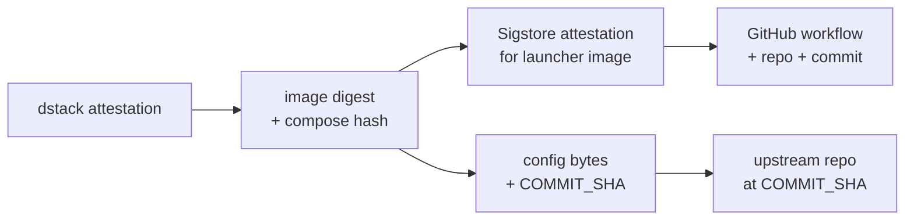
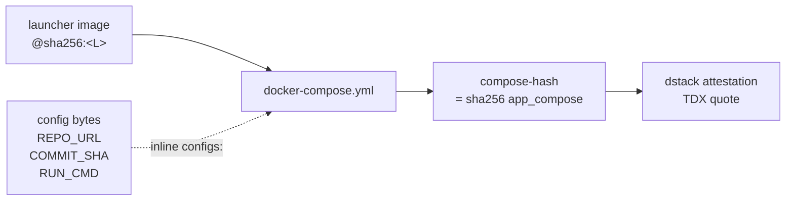
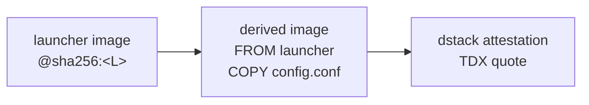

# Verifying a trusted-workload-launcher deployment

How a relying party verifies that a dstack CVM is running
`trusted-workload-launcher` and that the workload commit executed inside the
TEE is the one they audited.

## Quick path (5 steps)

For a verifier who already trusts dstack's attestation tooling, the whole
chain comes down to:



1. **Pull the dstack attestation** for the CVM with
   `phala cvms attestation --cvm-id <id> --json`, and verify the TDX quote
   with the dstack verifier (or trust Phala Cloud's verifier for the lite
   path).
2. **Read the attested compose** out of the quote. The launcher image
   digest and the inline `configs:` block containing `REPO_URL` and
   `COMMIT_SHA` both live there; both are covered by the dstack
   `compose-hash` measurement.
3. **Verify launcher image provenance.** Check the Sigstore attestation on
   the image digest: it must be signed by the
   `Dstack-TEE/dstack-examples` GitHub Actions workflow that produced it,
   from a known repo, ref, and commit.
4. **Confirm the pinned workload commit** by checking out the upstream
   repo at `COMMIT_SHA` and reviewing it.
5. **Spot-check runtime logs** — `phala logs --cvm-id <id>` should show
   `HEAD verified: <COMMIT_SHA>`. Logs are corroborating only; the trust
   root is steps 1–4.

If all five line up, the bytes executing in the TEE are exactly the
upstream commit you audited, produced by an audited launcher.

The rest of this document explains how the chain works and what to do at
each step.

## How the chain works

Two configuration approaches are supported. The recommended one for
production is **compose-mounted config**: the workload pin lives inline in
the compose file, dstack measures the compose into the attested
`compose-hash`, and the same compose can be governed by dstack's KMS
policy. The other approach, **derived image**, bakes the config into a
downstream image; the image digest then covers both launcher and pin.

### Recommended: compose-mounted config



The compose YAML references the generic launcher image by digest and
provides the launcher's config via a compose `configs:` block (with
`content:` inline). dstack measures the resulting `app_compose` JSON into
the quote as the `compose-hash` event, so changing either the image
reference or the config bytes changes the attestation.

This is also the surface that dstack KMS policy governs: a CVM can only
unwrap KMS-protected secrets while running a compose whose hash matches
what the policy allows.

### Alternative: derived image



A small downstream image is built `FROM` the launcher image and `COPY`s
the config in. Its single digest binds both launcher and pin. The
attested compose carries just the derived image reference. This avoids
inline `configs:` but means the pin is no longer governed by compose-level
KMS policy — change the pin, rebuild the image, get a new digest.

Use this path if you need a single digest to fully describe the workload,
or if downstream tooling cannot author compose `configs:` blocks.

## Step-by-step verifier checklist

The CLI calls below assume a Phala CLI authenticated against the workspace
that owns the CVM. The CVM identifier can be UUID, `app_id`, instance ID,
or name.

### 1. Fetch and verify the dstack attestation

```sh
phala cvms attestation --cvm-id <id> --json > attestation.json
```

The JSON contains the TDX quote, `tcb_info` (with `mrtd`, `rtmr0`–`rtmr3`,
`event_log`, `app_compose`), and the certificate chain. Feed it into the
dstack verifier (or trust the Phala Cloud verifier as the lite path) to
confirm:

* The quote signs over dstack's measurements with a valid Intel TDX
  signing chain.
* The measurements are consistent with the running platform identity.

### 2. Read image digest and compose hash from the attestation

The attested compose lives at `tcb_info.app_compose` (a JSON string). Its
SHA-256 is the `compose-hash` event in `tcb_info.event_log` (`imr: 3`,
`event: "compose-hash"`), and is what the TDX quote attests.

```sh
jq -r '.tcb_info.app_compose' attestation.json | sha256sum
jq -r '.tcb_info.event_log[] | select(.event=="compose-hash") | .event_payload' attestation.json
```

The two hex strings must match. Then parse the compose and pull the
launcher image reference plus the inline `configs:` block:

```sh
jq -r '.tcb_info.app_compose' attestation.json \
  | jq -r '.docker_compose_file'
```

The image reference is what you compare to your published launcher image
in step 3; the `configs:` block is what you parse in step 5.

### 3. Verify launcher image provenance via Sigstore

The `trusted-workload-launcher-release.yml` workflow publishes an
`actions/attest-build-provenance` attestation bound to the pushed image
digest. The attestation is not a claim of bit-for-bit reproducibility — it
is a signed statement that *this* OCI digest was produced by *this*
GitHub Actions workflow run, from a specific repo / ref / commit, using
the GitHub OIDC identity.

```sh
gh attestation verify \
  --owner Dstack-TEE \
  oci://docker.io/<org>/trusted-workload-launcher@sha256:<L>
```

or equivalently with `cosign verify-attestation` against
`https://search.sigstore.dev/?hash=sha256:<L>`. Confirm:

* the subject digest equals the image digest from step 2;
* the signing identity is the expected
  `Dstack-TEE/dstack-examples` workflow at the expected ref / commit.

That commit is the source of truth for the launcher's bytes. Treat the
Sigstore attestation as the chain of custody from the
`trusted-workload-launcher/` source at that commit to the deployed image
digest.

If you want to go further you can rebuild the image from that commit and
compare digests. The image build is deterministic in practice (Ubuntu
base pinned by digest, minimal apt install, single `COPY` of the bash
script), but the release process does not guarantee bit-for-bit
reproducibility, so a digest mismatch on rebuild is not necessarily
evidence of tampering.

### 4. Extract and audit the workload pin

Parse the `configs:` content from step 2 and read `REPO_URL`,
`COMMIT_SHA`, `INSTALL_CMD`, `RUN_CMD` (and optional `REPO_SUBDIR` /
`CHILD_ENV_FILE`). Then:

```sh
git -C <workload-checkout> rev-parse --verify <COMMIT_SHA>
```

Confirm the upstream repo at `REPO_URL` contains `COMMIT_SHA`, and review
the workload at that commit. This is the code that actually serves
traffic.

### 5. Spot-check runtime logs

```sh
phala logs --cvm-id <id> -n 200
```

Expected:

```
[trusted-workload-launcher] checking out <COMMIT_SHA>
[trusted-workload-launcher] HEAD verified: <COMMIT_SHA>
[trusted-workload-launcher] exec in <WORK_DIR>[/<REPO_SUBDIR>]: <RUN_CMD>
```

These show the launcher reached the post-checkout state. They are not
signed, so they don't replace steps 1–4 — they corroborate.

A workload that needs signed runtime evidence should produce its own
attested output (see [Limitations](#limitations)).

## Reference: production smoke transcript

A real verification of this example was exercised against production
Phala on 2026-05-11 using the recommended compose-mounted-config path:

| Field | Value |
| --- | --- |
| Launcher image | `docker.io/h4x3rotab/trusted-workload-launcher-smoke@sha256:0d3f2dbda5e6ae9513ea4e8e69dcbc87c1f3af29744f0e36b9814685e5739866` |
| Compose pattern | inline `configs:` with `content:` block carrying the launcher config |
| Workload repo | `https://github.com/octocat/Hello-World.git` |
| Pinned commit | `7fd1a60b01f91b314f59955a4e4d4e80d8edf11d` |
| CVM name | `twl-cfg-smoke-20260511-180207` (deleted post-verification) |
| App ID | `app_5696a018cb75b2beadb3b44e9a379058ca2ed6c3` |
| `compose-hash` (imr 3) | `995f0e566f6e14382dedfff53203eebbd729b7e0307724df0e60c6e4d1d2b752` |
| `sha256(app_compose_json)` | `995f0e566f6e14382dedfff53203eebbd729b7e0307724df0e60c6e4d1d2b752` — matches |

The match between the `compose-hash` event in `tcb_info.event_log` and
the SHA-256 of `tcb_info.app_compose` is the binding the recommended path
relies on: change the compose (image reference or inline config bytes),
get a different attestation.

`phala ps --cvm-id <id>` showed the running container's image was exactly
the expected launcher digest. `phala logs --cvm-id <id>` showed:

```
[trusted-workload-launcher] checking out 7fd1a60b01f91b314f59955a4e4d4e80d8edf11d
[trusted-workload-launcher] HEAD verified: 7fd1a60b01f91b314f59955a4e4d4e80d8edf11d
[trusted-workload-launcher] exec in /var/lib/trusted-workload-launcher/hello: ...
TWL_PINNED_HEAD=7fd1a60b01f91b314f59955a4e4d4e80d8edf11d
TWL_README_BYTES=13
TWL_READY
```

`TWL_PINNED_HEAD` is from `git rev-parse HEAD` evaluated *inside the TEE
container* by the workload's `RUN_CMD`, so it is independent
corroboration that the bytes running are the pinned commit.

## Limitations

* **No receipt signing in the launcher.** The launcher fetches and execs
  code; it does not sign its own outputs. Workload identity for
  individual responses must be implemented by the workload itself (for
  example via an in-TEE signing key released by dstack KMS).
* **No per-response workload identity key.** A relying party cannot ask
  "is this response from the workload at `COMMIT_SHA`?" by checking a
  signature the launcher produced. Identity here means "is the CVM
  measured as running this image+config?" — a deployment-level identity,
  not a per-response identity.
* **Runtime logs are not signed.** Logs are useful for forensics and
  smoke testing but cannot be the trust root for a remote verifier.
* **Generic image digest alone does not bind the workload pin.** The
  compose hash (compose-mounted path) or derived-image digest (alternative
  path) is what binds them.
* **Sigstore attestation ≠ reproducibility.** Verifying the Sigstore
  attestation tells you the image digest was produced by a specific
  GitHub Actions workflow run from a specific commit. The release
  process does not guarantee bit-for-bit rebuilds.
* **Trust in the upstream Git host.** The launcher verifies the
  `COMMIT_SHA` it actually checked out, but it does not enforce which
  Git host serves it. `REPO_URL` is part of the attested config; review
  and trust that URL together with the rest of the config.
