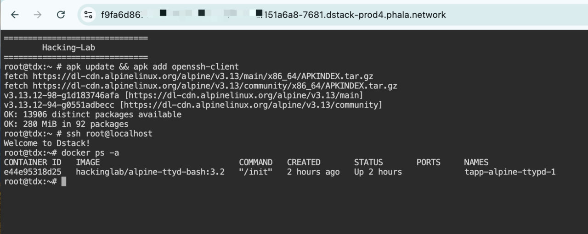

# Accessing Dstack CVM with a Webshell

When developing with Dstack CVM using a development image (e.g., dstack-dev-0.3.4), having a webshell to access the container can be extremely beneficial for debugging and troubleshooting. This guide outlines the steps to set up and use a webshell with the ttyd service.


## Steps to Set Up and Use the Webshell

### 1. Add the `ttyd` Service to Your `docker-compose.yaml`

Copy the `ttyd` service definition from the [docker-compose.yaml](docker-compose.yaml) file provided and include it in your own `docker-compose.yaml` file.

### 2. Update the CVM Configuration

Update the CVM with the updated `docker-compose.yaml` to include the `ttyd` service in PHALA Cloud. This operation will restart the CVM.

### 3. Access the Webshell Endpoint

After the CVM is updated, locate the endpoint URL for the `ttyd` service. The URL typically follows this pattern:

```
https://<app-id>-7681.dstack-prod4.phala.network/
```

Open this URL in your browser to access the webshell.

### 4. Install SSH Client and Connect to Host CVM

Once inside the webshell, execute the following commands to install the SSH client and connect to the host CVM:

```bash
apk update && apk add openssh-client
ssh root@localhost
```



This will allow you to SSH into the host CVM for debugging purposes.

---

## Important Notes

- **Development Image:**  
  The `ttyd` service is designed for use with development images (e.g., `dstack-dev-0.3.4`). It allows you to SSH into the host CVM for debugging.

- **Production Image:**  
  In production images, the host CVM does not has ssh server service enabled, so the `ttyd` service does not support SSH access to the host CVM. However, it can still be used to view and edit files in the host CVM through the `/host` path.

---

By following this guide, you can effectively set up and utilize a webshell to enhance your development and debugging workflow with Dstack CVM.
